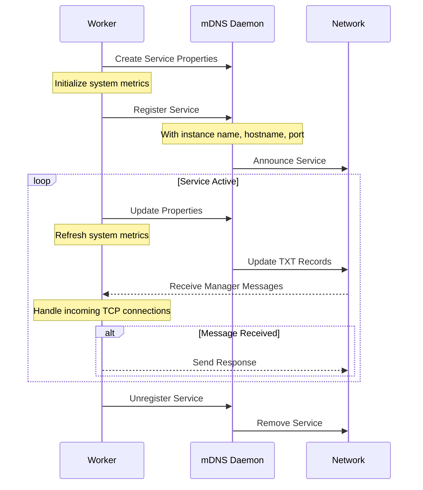
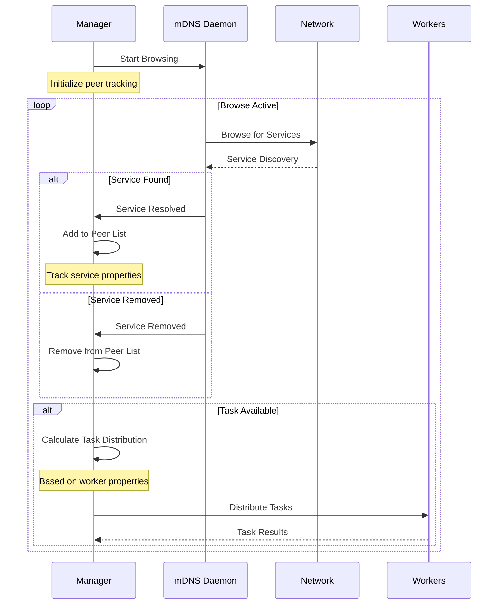

# Worker

```mermaid
sequenceDiagram
    participant W as Worker
    participant MDNS as mDNS Daemon
    participant NET as Network

    W->>MDNS: Create Service Properties
    Note over W: Initialize system metrics

    W->>MDNS: Register Service
    Note over MDNS: With instance name, hostname, port
    MDNS->>NET: Announce Service

    loop Service Active
        W->>MDNS: Update Properties
        Note over W: Refresh system metrics
        MDNS->>NET: Update TXT Records

        NET-->>W: Receive Manager Messages
        Note over W: Handle incoming TCP connections

        alt Message Received
            W-->>NET: Send Response
        end
    end

    W->>MDNS: Unregister Service
    MDNS->>NET: Remove Service
```

# Manager

```mermaid
sequenceDiagram
    participant C as Manager
    participant MDNS as mDNS Daemon
    participant NET as Network
    participant W as Workers

    C->>MDNS: Start Browsing
    Note over C: Initialize peer tracking

    loop Browse Active
        MDNS->>NET: Browse for Services
        NET-->>MDNS: Service Discovery

        alt Service Found
            MDNS->>C: Service Resolved
            C->>C: Add to Peer List
            Note over C: Track service properties
        else Service Removed
            MDNS->>C: Service Removed
            C->>C: Remove from Peer List
        end

        alt Task Available
            C->>C: Calculate Task Distribution
            Note over C: Based on worker properties
            C->>W: Distribute Tasks
            W-->>C: Task Results
        end
    end
```
